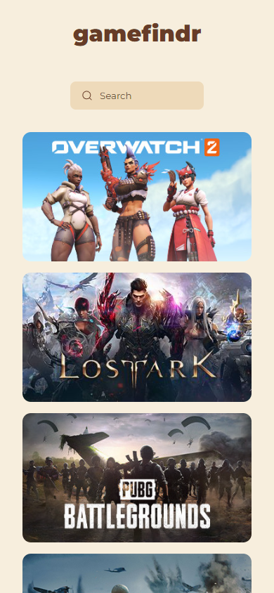

# gamefindr

[**gamefindr**](https://beniusis.github.io/gamefindr) is a simple application for searching games and information about them.

## Table of Contents

- [Overview](#overview)
  - [Features](#features)
  - [Technologies and Tools](#technologies-and-tools)
  - [Screenshots](#screenshots)
- [Setup the Development Environment](#setup-the-development-environment)
  - [Install the required dependencies](#install-the-required-dependencies)
  - [Compile and Hot-Reload for Development](#compile-and-hot-reload-for-development)
  - [Format with Prettier](#format-with-prettier)

## Overview

### Features

- **Search**: users are able to search for games by name.
- **Game Information**: users are able to view more information about a certain game by clicking on them.
- **Responsive Design**: ensuring a seamless user experience for all devices.

### Technologies and Tools

- 🖼️ **Framework**: [Vue](https://vuejs.org)
- 😎 **Styling**: CSS
- 🎮 **Data**: [FreeToGame API](https://www.freetogame.com/api-doc)
- 🗺️ **Routing**: [Vue Router](https://router.vuejs.org)
- ✨ **Code Quality**: [Prettier](https://prettier.io)
- 🏗️ **Build Tool**: [Vite](https://vitejs.dev)

### Screenshots




## Setup the Development Environment

### Install the required dependencies

```sh
npm install
```

### Compile and Hot-Reload for Development

```sh
npm run dev
```

### Format with Prettier

```sh
npm run format
```
